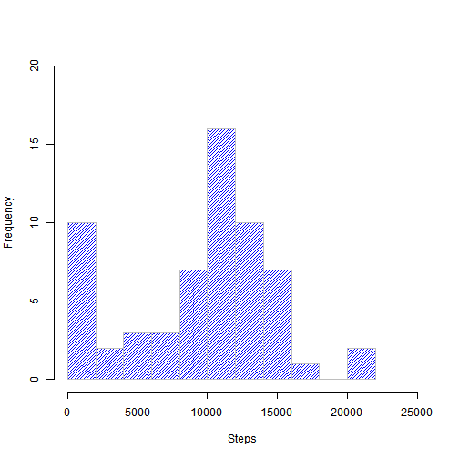
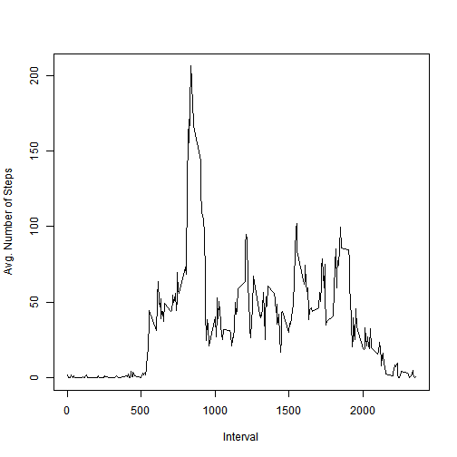
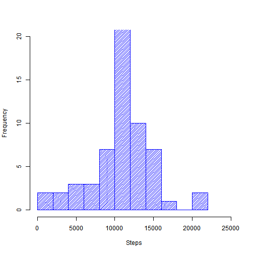
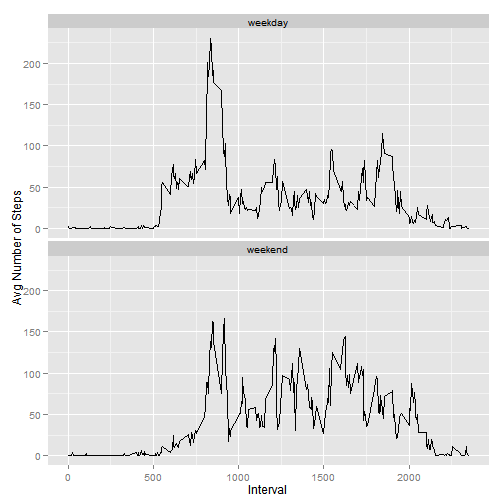

## Reproducible Research: Peer Assessment 1
This assignment requires to write a report that answers the questions detailed below. The entire assignment is to be completed in a **single R markdown** document that can be processed by **knitr** and transformed into an HTML file.

### PART 1: Loading and preprocessing the data


```r
# Unzip and read the data file from current working directory
unzip("activity.zip", overwrite = T, exdir = ".")
df <- read.csv("activity.csv", header=T, colClasses=c("numeric", "character", "numeric"))

# Convert date format for processing weekdays
df$date <- as.Date(df$date, format="%Y-%m-%d")

# Make data table to process/transform the dataset
dt <- data.table(df, key="date")

# Calculate sum and mean for steps per day, ignoring missing values
d.steps <- dt[, list(d.sum=sum(steps, na.rm=T), d.mean=mean(steps, na.rm=T)), by=list(date)]
```

### PART 2: What is mean total number of steps taken per day?
- Histogram of steps taken per day  

 

- **mean** = 9354.23 and **median** = 10395.00 for total number of steps per day.

### PART 3: What is the average daily activity pattern?
- Plot of the 5-minute interval and average number of steps across all days:  

 

- Interval **835** contains the maximun avg. number of steps of 206.17

### PART 4: Imputing Missing Values

- Total number of missing values in the dataset (i.e. rows with `NA`s): 2304

    - 15264 good counts / 17568 total observations

- Filled in missing values with the mean number of steps for the interval
- Created new dataset with the missing data filled in:


```r
# Merge dataset of computed interval averages with original data, joining by the interval
dt2 <- merge(dt, i.steps, by="interval")

# Create a new column containing either: a) the mean # of steps for the interval, when steps
# are missing; otherwise, b) the original number of steps for the interval
dt2 <- dt2[, fill:={ifelse(is.na(steps), i.mean, steps)}]
```
- Histogram of the estimated total number of steps taken each day
  
 

- New **mean** = 10766.19, **median** = 10766.19 for  estimated steps per day

- These estimated values differ from the first part of the assignment, as follows:

    + estimated mean differs by 1411.96 (15.1%) from original
    + estimated median differs by 371.19 (3.6%) from original

- Impact of imputing missing data on the estimates of the total daily number of steps:

    - flattens the distribution over the intervals, spiked at the mean
    - tends to underestimate variance

### PART 5: Differences in activity patterns between weekdays and weekends

- Create a new factor variable in the dataset with two levels -- "weekday" and "weekend" indicating whether a given date is a weekday or weekend day.

```r
dt2$d.type <- ifelse(weekdays(dt2$date) %in% c("Saturday", "Sunday"), "weekend", "weekday")
```

- Make a panel plot containing a time series of the 5-minute interval (x-axis) and the average number of steps taken, averaged across all weekday days or weekend days (y-axis).

 
